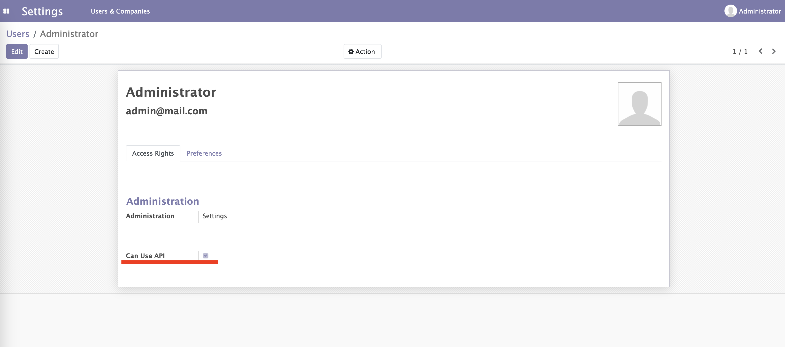

# Project Name
Odoo with Custom material module
Try on server
https://kedatech.siap.tech

Python: Python 3.8

## Description
Additional module to manage materials, and supplier. Available on web dashboard and REST API that can be activated on user settings

## Installation

Provide detailed instructions on how to install your project. This could include:
### Ubuntu
You can follow this step to install dependencies
https://www.cybrosys.com/blog/how-to-install-odoo-16-on-ubuntu-2004-lts

Start Server using
`./odoo-bin -c ./debian/odoo.conf --update=all`

### Docker
Build Docker image 
`docker build --tag odoo-docker:latest .`

Run Docker
`docker run --name odoo-docker -v /path/to/odoo.conf:/usr/src/app/config -p 8069:8069 odoo-docker:latest`

### Using API
First you need to authorize user for API Usage on Setting User page.

This is postmant collection for this project:
https://documenter.getpostman.com/view/1487291/2s9YsDkaPa

Server Admin User:
`db name: kedatech-odoo-1`
`email: admin@mail.com`
`password: password`

### Testing
You can start testing using this command
`./odoo-bin -c ./debian/odoo.conf --update=all --log-level=test --test-enable`